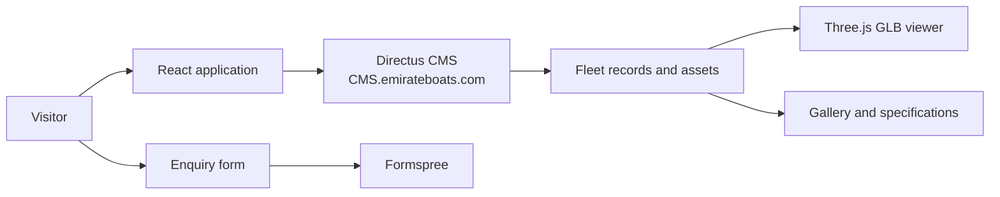

# Emirates Boats | Interactive Fleet Showcase

> A production-facing website for **Emirates Boats LLC**, built as a portfolio project by [Rehan Rathnaweera](https://www.linkedin.com/in/rehanratnaweera).

Emirates Boats is a Dubai-based marine manufacturer. This site presents the company, its build philosophy, and its current fleet through a cinematic responsive experience with live CMS content and interactive 3D boat models.

## What the site does

- Loads boat records, technical specifications, imagery, model files, and datasheets from a Directus CMS.
- Lets visitors switch between fleet models and inspect each one in a Three.js viewer.
- Supports orbit controls, auto-rotation, zoom, responsive resizing, and CMS-driven material colours.
- Provides a gallery with thumbnails, previous/next navigation, keyboard controls, and a lightbox.
- Presents construction details, build stages, bespoke-build messaging, and company contact information.
- Sends enquiries through Formspree without requiring a custom backend.
- Builds into a small static bundle served by Nginx inside a Docker image.

## Product flow



The browser requests the fleet on initial load. `src/cmsfetch.tsx` normalises the flexible Directus response into a typed `BoatModel`, so the rest of the UI can work with a stable shape. If the request fails, the app shows a clear CMS error state instead of rendering an empty fleet.

## Tech stack

| Area | Technology |
| --- | --- |
| UI | React 19, TypeScript |
| Build tool | Vite 8 |
| Styling | Tailwind CSS 4 plus focused component CSS |
| 3D | Three.js, `GLTFLoader`, `OrbitControls` |
| Content | Directus REST API |
| Enquiries | Formspree React |
| Production server | Nginx on Alpine Linux |
| Release tooling | GitHub Actions, pnpm, semantic-release, Commitlint, Husky |

## Repository map

```text
.
├── src/
│   ├── App.tsx                 # Page composition, navigation, sections, and fleet state
│   ├── cmsfetch.tsx            # Directus client and CMS-to-UI data mapping
│   ├── index.css               # Theme tokens, layout utilities, forms, gallery, and viewer styles
│   ├── main.tsx                # React entry point
│   └── components/
│       ├── BoatViewer.tsx       # Three.js scene, GLB loading, lights, controls, and cleanup
│       ├── BoatDetails.tsx      # Gallery, lightbox, specification sheet, and datasheet download
│       └── contactbox.tsx       # Formspree enquiry form and validation states
├── .github/workflows/
│   └── release.yml             # Build, publish, package, and release automation
├── .eb/make/site.json          # Generated site metadata used by the Vite config
├── dockerfile                  # Nginx image for the compiled dist/ directory
├── vite.config.ts              # Vite, Tailwind, metadata, chunking, and server configuration
└── package.json                # Scripts and dependency manifest
```

## Running locally

### Requirements

- Node.js 22 or newer
- pnpm `12.0.0-rc.11` (the version declared by `package.json`)
- Network access to the Directus CMS for the fleet to load

```bash
pnpm install
pnpm run dev
```

The development server listens on `http://localhost:3000` and binds to `0.0.0.0`, which also makes it reachable from a local device or container.

Useful commands:

```bash
pnpm run build       # Create the production bundle in dist/
pnpm run preview     # Serve the production bundle locally
pnpm run format      # Format supported source files with oxfmt
```

There is currently no test or lint script in `package.json`; the production build is the primary automated application check.

## CMS integration

The frontend reads from:

```text
https://cms.emirateboats.com/items/boats
```

Each boat record can provide:

- Identity: `id`, `name`, `tagline`
- 3D asset: `model_file`
- Downloadable document: `datasheet_file`
- Gallery: `gallery`
- Appearance: `material_colors`, `zoom_factor`
- Technical data: `length`, `beam`, `displacement`, `range`, `power`, `speed`, `capacity`, `construction`
- Editorial content: `description`

The mapper accepts several field aliases and both Directus asset IDs and full URLs. Material colours may be supplied as a keyed object or as an array of mesh/material entries. This keeps the presentation layer independent of minor CMS naming differences.

The CMS must allow browser requests from the deployed site and expose the related asset fields requested by `fetchBoats`. If Directus is unavailable or returns an invalid payload, the application displays an error status.

## Production delivery

Pushing to `main` triggers [.github/workflows/release.yml](.github/workflows/release.yml), which:

1. Installs the locked dependency tree with pnpm.
2. Builds the Vite application into `dist/`.
3. Builds and publishes `ghcr.io/rehanratnaweera/emiratesboats_website:latest`.
4. Archives the static build as a release asset.
5. Runs semantic-release to analyse Conventional Commits and publish release metadata.

The Docker image uses Nginx to serve the compiled static files:

```bash
pnpm run build
docker build -f dockerfile -t emirates-boats .
docker run --rm -p 8080:80 emirates-boats
```

Then open `http://localhost:8080`.

Vite also supports an optional public path through `eb_PUBLIC_URL`. The dev and preview ports can be changed with `PORT`.

## Implementation notes

- Three.js is isolated into its own Rollup chunk to improve browser caching for the heavier 3D dependency.
- `BoatViewer` disposes controls, observers, animation frames, the renderer, and the scene when a model changes or the component unmounts.
- Boat model bounds are calculated at runtime so different GLB dimensions can share a consistent viewing scale.
- The UI uses responsive Tailwind layout utilities alongside CSS theme variables and the Fraunces / DM Mono / Inter type system.
- The contact form includes browser validation, Formspree validation errors, submission state, and a success state.
- The app uses an `AbortController` when loading fleet data, preventing stale requests during unmount.

## Project status

This is an actively evolving portfolio representation of a live client-facing site. CMS content, external media URLs, Formspree configuration, and deployment credentials are intentionally kept outside the repository where possible.

## License and content

The source is published for portfolio and demonstration purposes. Emirates Boats branding, copy, imagery, 3D assets, and CMS content belong to their respective owners and should not be reused without permission.
